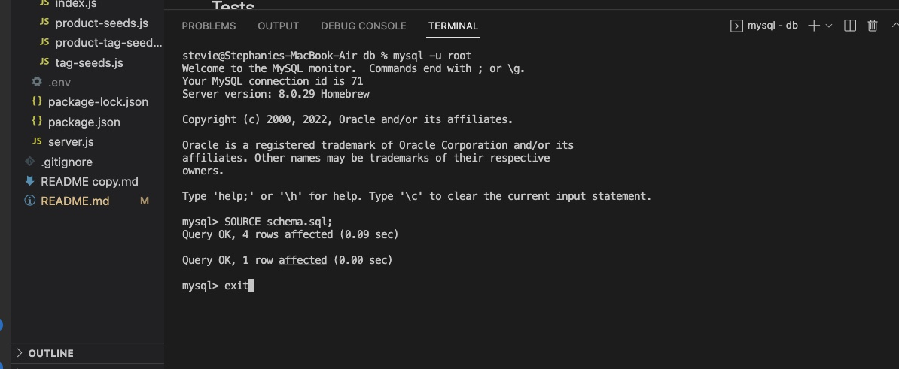
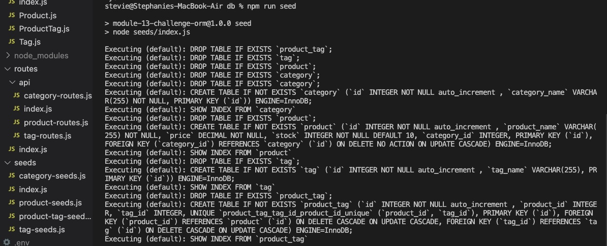

# e-commerce-back-end-repo

  ## Description
  This is a back-end e-commerce application consisting of a working Express.js API with Sequelize and MySQL database interaction. The application was created with with some starter code provided.
  
  ## Table of Contents
  
  - [Installation](#installation)
  - [Usage](#usage)
  - [Credits](#credits)
  - [Contributing](#contributing)
  - [Tests](#tests)
  - [Questions](#questions)
  
  ## Installation
  Clone e-commerce-back-end-repo from GitHub https://github.com/smariagomez/e-commerce-back-end-repo and then open that repo in your code editor (e.g., VS Code).
  
  ## Usage
  Once the repo has been opened in the your code editor you will run "mysql -u root" and "SOURCE schema.sql;" in the command line, then "exit." After these step have been completed you will run "npm run seed" in the command line followed by "npm start." Create, Read, Update and Delete methods can then be completed in the command line. The involved API pathways have been verified using Insomnia.

  
   

  Walkthrough video tutorial, including Jest testing: 
      
  ## Credits
 Express.js, npm (MySQL), Node.js (Sequelize), Insomnia (https://insomnia.rest/), GitHub
  
  ## Contributing
   Please review the [Contributor Covenant](https://www.contributor-covenant.org/) for guidlines on how to contribute to this application.
  
  ## Tests
  Currently there are no tests written for this application.

  ## Questions

  If you have any questions about the repo, you can open an issue or contact me directly at: stephaniemariagomez@gmail.com. See more of my work at https://github.com/smariagomez.